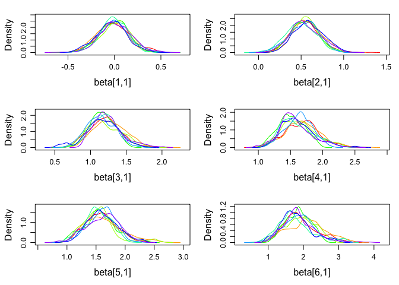
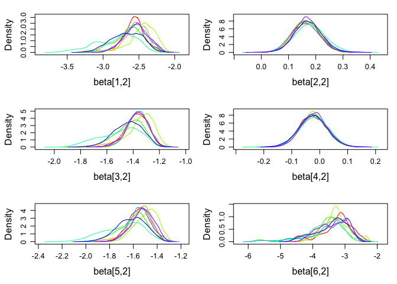

<!-- README.md is generated from README.Rmd. Please edit that file -->
R/diagacc: Modelling diagnostic errors using latent class models
================================================================

[](https://travis-ci.org/haziqj/diagacc) [](https://ci.appveyor.com/project/haziqj/diagacc) [](https://codecov.io/github/haziqj/diagacc?branch=master)

This is the `R` package accompanying our paper: *Diagnostic Accuracy for Schistosomiasis: Applications of Latent Class Modelling Approaches With and Without a Gold Standard*. There are three models primarily used in this package: latent class model (LC), latent class with random effects model (LCRE), and a finite mixture model (FM). Details of these models and their use for modelling diagnostic errors are found in the paper.

The package includes functions to

1.  Simulate a data set from either the LC, LCRE or FM model.
2.  Wrapper functions to fit such models and obtain estimates and standard errors/posterior standard deviations of sensitivities, specificities, prevalence.
    -   LC and LCRE models can be fitted using EM algorithm (`randomLCA` package) or MCMC (`JAGS`)
    -   FM models are fitted using MCMC (`JAGS`)
3.  Functions to perform a simulation study, as per the following:
    -   Simulate data based on a certain scenario (sensitivities, specificities, prevalance, proportion of missing gold standard, and data generating mechanism)
    -   Fit the data using LC, LCRE and FM models
    -   Repeat the above two steps using a different random seed, and results averaged The results are shown in tabular form or in a graph.

Installation and setting options
================================

The easiest way to then install from this repo is by using the [devtools](https://github.com/hadley/devtools) package. Install this first.

``` r
install.packages("devtools")
```

Then, run the following code to install and attach the `diagacc` package.

``` r
## devtools::install_github("haziqj/diagacc")
library(diagacc)
#> Using the following sensitivities and specificities for the tests.
#> Use diagacc_opt() to change these settings.
#>            Sensitivity Specificity
#> Microscopy        0.60        0.99
#> Dipsticks         0.73        0.45
#> CAA               0.90        0.87
#> Antibody          0.90        0.50
#> LAMP              0.95        0.90
#> Gold std.         1.00        1.00
```

The default number of items is six (including a gold standard item), with the sensitivities and specificities as shown above. To change this, use the `diagacc_opt()` function.

``` r
# Change sensitivities, specificities and item names
diagacc_opt(sens = runif(6), spec = runif(6), item.names = LETTERS[1:6])
#>   Sensitivity Specificity
#> A   0.3659492 0.073139574
#> B   0.4943445 0.009662902
#> C   0.4804491 0.577726134
#> D   0.8525030 0.577721392
#> E   0.5699537 0.702041479
#> F   0.5540580 0.522064021

# Restore default options
diagacc_opt(default = TRUE)
#>            Sensitivity Specificity
#> Microscopy        0.60        0.99
#> Dipsticks         0.73        0.45
#> CAA               0.90        0.87
#> Antibody          0.90        0.50
#> LAMP              0.95        0.90
#> Gold std.         1.00        1.00
```

Simulating data sets
====================

The functions to simulate a data set are `gen_lc()`, `gen_lcre()` and `gen_fm()`.

``` r
# Sample size (n), proportion of missing gold item (miss.prop), and prevalence
# (tau), using a specific random seedmys
X <- gen_lc(n = 1000, miss.prop = 0.5, tau = 0.1, seed = 123)
head(X)
#>   Microscopy Dipsticks CAA Antibody LAMP Gold std.
#> 1          0         0   0        1    0        NA
#> 2          0         0   0        0    0        NA
#> 3          0         1   0        1    0         0
#> 4          0         0   0        0    0        NA
#> 5          1         0   1        1    1        NA
#> 6          0         0   0        0    0        NA
```

Obtain estimates
================

The functions for model fitting are `fit_lc()`, `fit_lcre()` and `fit_fm()`. The first two of these functions has the option `method = c("EM", "MCMC")`.

``` r
# Fitting a LC model using EM algorithm
(mod1 <- fit_lc(X))
#> $prevalence
#> [1] 0.09606515
#> 
#> $sens.and.spec
#>            Sensitivity Specificity
#> Microscopy   0.5090139   0.9877177
#> Dipsticks    0.6758673   0.4423591
#> CAA          0.8535290   0.8838352
#> Antibody     0.9178501   0.5067962
#> LAMP         0.9145385   0.9091265
#> 
#> $se.prev
#> [1] 0.1214575
#> 
#> $se.sens.and.spec
#>            Sensitivity Specificity
#> Microscopy   0.1372929  0.12443230
#> Dipsticks    0.1397397  0.04208410
#> CAA          0.1831331  0.05681371
#> Antibody     0.2018094  0.04212730
#> LAMP         0.2189492  0.06376226
```

``` r
# Fitting a LC model using MCMC
(mod2 <- fit_lc(X, method = "MCMC"))
#> Loading required namespace: rjags
#> module lecuyer loaded
#> Compiling rjags model...
#> Calling the simulation using the rjags method...
#> Adapting the model for 200 iterations...
#> Burning in the model for 800 iterations...
#> Running the model for 10000 iterations...
#> Simulation complete
#> Calculating summary statistics...
#> Warning: Convergence cannot be assessed with only 1 chain
#> Finished running the simulation
#> $prevalence
#>        tau 
#> 0.09957279 
#> 
#> $sens.and.spec
#>            Sensitivity Specificity
#> Microscopy   0.4992510   0.9870487
#> Dipsticks    0.6737878   0.4425871
#> CAA          0.8404179   0.8846096
#> Antibody     0.9081559   0.5079724
#> LAMP         0.9033691   0.9104076
#> 
#> $se.prev
#>        tau 
#> 0.01041894 
#> 
#> $se.sens.and.spec
#>            Sensitivity Specificity
#> Microscopy  0.05325026 0.004073068
#> Dipsticks   0.05080527 0.016512496
#> CAA         0.04185452 0.011296775
#> Antibody    0.03169638 0.016931291
#> LAMP        0.03595716 0.010203718
```

There is also the option for `raw = TRUE`, which return the actual `rjags` or `randomLCA` object for further inspection or manipulation. This is especially useful for MCMC diagnostics.

``` r
# Running 8 chains in parallel 
mod3 <- fit_lcre(X, method = "MCMC", raw = TRUE, silent = TRUE, n.chains = 8, 
                 runjags.method = "parallel")
#> Warning: The length of the initial values argument supplied found does
#> not correspond to the number of chains specified. Some initial values were
#> recycled or ignored.
#> Warning: You attempted to start parallel chains without setting different
#> PRNG for each chain, which is not recommended. Different .RNG.name values
#> have been added to each set of initial values.
#> Loading required namespace: rjags
#> module lecuyer loaded
plot(mod3, plot.type = "density", layout = c(3, 2), vars = "beta")
```


