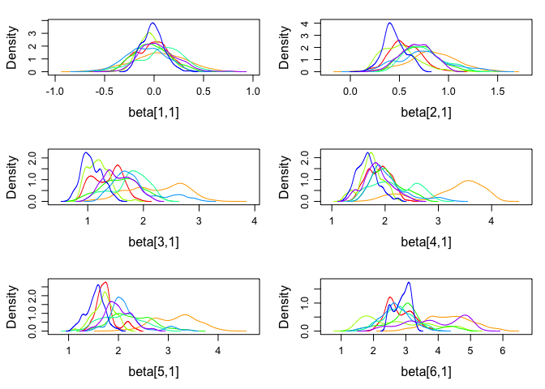

<!-- README.md is generated from README.Rmd. Please edit that file -->
R/diagacc: Modelling diagnostic errors using latent class models
================================================================

[](https://travis-ci.org/haziqj/diagacc) [](https://ci.appveyor.com/project/haziqj/diagacc) [](https://codecov.io/github/haziqj/diagacc?branch=master)

This is the `R` package accompanying our paper: *Diagnostic Accuracy for Schistosomiasis: Applications of Latent Class Modelling Approaches With and Without a Gold Standard*. There are three models primarily used in this package: latent class model (LC), latent class with random effects model (LCRE), and a finite mixture model (FM). Details of these models and their use for modelling diagnostic errors are found in the paper.

The package includes functions to

1.  Simulate a data set from either the LC, LCRE or FM model.
2.  Wrapper functions to fit such models and obtain estimates and standard errors/posterior standard deviations of sensitivities, specificities, prevalence.
    -   LC and LCRE models can be fitted using EM algorithm (`randomLCA` package) or MCMC (`JAGS`)
    -   FM models are fitted using MCMC (`JAGS`)
3.  Functions to perform a simulation study, as per the following:
    -   Simulate data based on a certain scenario (sensitivities, specificities, prevalance, proportion of missing gold standard, and data generating mechanism)
    -   Fit the data using LC, LCRE and FM models
    -   Repeat the above two steps using a different random seed, and results averaged The results are shown in tabular form or in a graph.

Installation and setting options
================================

The easiest way to then install from this repo is by using the [devtools](https://github.com/hadley/devtools) package. Install this first.

``` r
install.packages("devtools")
```

Then, run the following code to install and attach the `diagacc` package.

``` r
## devtools::install_github("haziqj/diagacc")
library(diagacc)
#> Using the following sensitivities and specificities for the tests.
#> Use diagacc_opt() to change these settings.
#>            Sensitivity Specificity
#> Microscopy        0.60        0.99
#> Dipsticks         0.73        0.45
#> CAA               0.90        0.87
#> Antibody          0.90        0.50
#> LAMP              0.95        0.90
#> Gold std.         1.00        1.00
```

The default number of items is six (including a gold standard item), with the sensitivities and specificities as shown above. To change this, use the `diagacc_opt()` function.

``` r
# Change sensitivities, specificities and item names
diagacc_opt(sens = runif(6), spec = runif(6), item.names = LETTERS[1:6])
#>   Sensitivity Specificity
#> A 0.499790129  0.12094235
#> B 0.089602758  0.58447496
#> C 0.733180320  0.26924845
#> D 0.881568725  0.05405493
#> E 0.005715412  0.20586111
#> F 0.041892616  0.07174037

# Restore default options
diagacc_opt(default = TRUE)
#>            Sensitivity Specificity
#> Microscopy        0.60        0.99
#> Dipsticks         0.73        0.45
#> CAA               0.90        0.87
#> Antibody          0.90        0.50
#> LAMP              0.95        0.90
#> Gold std.         1.00        1.00
```

Simulating data sets
====================

The functions to simulate a data set are `gen_lc()`, `gen_lcre()` and `gen_fm()`.

``` r
# Sample size (n), proportion of missing gold item (miss.prop), and prevalence
# (tau), using a specific random seedmys
X <- gen_lc(n = 1000, miss.prop = 0.5, tau = 0.1, seed = 123)
head(X)
#>   Microscopy Dipsticks CAA Antibody LAMP Gold std.
#> 1          0         0   0        1    0        NA
#> 2          0         0   0        0    0        NA
#> 3          0         1   0        1    0         0
#> 4          0         0   0        0    0        NA
#> 5          1         0   1        1    1        NA
#> 6          0         0   0        0    0        NA
```

Obtain estimates
================

The functions for model fitting are `fit_lc()`, `fit_lcre()` and `fit_fm()`. The first two of these functions has the option `method = c("EM", "MCMC")`.

``` r
# Fitting a LC model using EM algorithm
(mod1 <- fit_lc(X))
#> Latent class model fit
#>                  Mean    SE   2.5% 97.5%
#> Prevalence      0.096 0.121 -0.142 0.334
#> Sens.Microscopy 0.509 0.137  0.240 0.778
#> Sens.Dipsticks  0.676 0.140  0.402 0.950
#> Sens.CAA        0.854 0.183  0.495 1.212
#> Sens.Antibody   0.918 0.202  0.522 1.313
#> Sens.LAMP       0.915 0.219  0.485 1.344
#> Sens.Gold std.  0.992 2.280 -3.476 5.460
#> Spec.Microscopy 0.988 0.124  0.744 1.232
#> Spec.Dipsticks  0.442 0.042  0.360 0.525
#> Spec.CAA        0.884 0.057  0.772 0.995
#> Spec.Antibody   0.507 0.042  0.424 0.589
#> Spec.LAMP       0.909 0.064  0.784 1.034
#> Spec.Gold std.  1.000 4.369 -7.563 9.563
```

``` r
# Fitting a LC model using MCMC
(mod2 <- fit_lc(X, method = "MCMC"))
#> Loading required namespace: rjags
#> module lecuyer loaded
#> Compiling rjags model...
#> Calling the simulation using the rjags method...
#> Adapting the model for 200 iterations...
#> Burning in the model for 800 iterations...
#> Running the model for 2000 iterations...
#> Simulation complete
#> Calculating summary statistics...
#> Warning: Convergence cannot be assessed with only 1 chain
#> Finished running the simulation
#> Latent class model fit
#>                  Mean    SE  2.5% 97.5%
#> Prevalence      0.099 0.011 0.078 0.120
#> Sens.Microscopy 0.502 0.053 0.397 0.606
#> Sens.Dipsticks  0.671 0.049 0.575 0.766
#> Sens.CAA        0.841 0.042 0.759 0.922
#> Sens.Antibody   0.906 0.033 0.842 0.970
#> Sens.LAMP       0.903 0.037 0.831 0.975
#> Sens.Gold std.  0.946 0.043 0.862 1.029
#> Spec.Microscopy 0.987 0.004 0.979 0.995
#> Spec.Dipsticks  0.443 0.017 0.410 0.476
#> Spec.CAA        0.884 0.011 0.862 0.906
#> Spec.Antibody   0.508 0.017 0.475 0.540
#> Spec.LAMP       0.910 0.010 0.890 0.929
#> Spec.Gold std.  0.997 0.002 0.993 1.002
```

There is also the option for `raw = TRUE`, which return the actual `rjags` or `randomLCA` object for further inspection or manipulation. This is especially useful for MCMC diagnostics.

``` r
# Running 8 chains in parallel 
mod3 <- fit_lcre(X, method = "MCMC", raw = TRUE, silent = TRUE, n.chains = 8, 
                 runjags.method = "parallel")
#> Warning: The length of the initial values argument supplied found does
#> not correspond to the number of chains specified. Some initial values were
#> recycled or ignored.
#> Warning: You attempted to start parallel chains without setting different
#> PRNG for each chain, which is not recommended. Different .RNG.name values
#> have been added to each set of initial values.
#> Loading required namespace: rjags
#> module lecuyer loaded
plot(mod3, plot.type = "density", layout = c(3, 2), vars = "beta")
```



Simulation study
================

To perform a simulation study, use the `run_sim_par()` function. For instance, consider the following scenario: sample size = 500, prevalence = 0.1, missing gold standard = 20%, and data generated from a LCRE model. We shall run this for a total of `B=8` replications (just for show). The result is a table showing the estimates of the prevalance, sensitivities and specificities for all items except gold standard item, as fitted using the LC, LCRE and FM model.

``` r
(res <- run_sim_par(B = 8, n = 1000, tau = 0.1, miss.prop = 0.5,
                    data.gen = "lcre", no.cores = 8))
#> n = 1000, prev. = 0.1, missing gold = 50%, data gen. mech. = LCRE
#> 
  |                                                                       
  |                                                                 |   0%
  |                                                                       
  |========                                                         |  12%
  |                                                                       
  |================                                                 |  25%
  |                                                                       
  |========================                                         |  38%
  |                                                                       
  |================================                                 |  50%
  |                                                                       
  |=========================================                        |  62%
  |                                                                       
  |=================================================                |  75%
  |                                                                       
  |=========================================================        |  88%
  |                                                                       
  |=================================================================| 100%
#> LC model fit
#>                 truth    Est      2.5%     97.5%    SE       2.5%    
#> Prevalence        0.100    0.250    0.228    0.272    0.091    0.078 
#> Sens.Microscopy   0.600    0.282    0.258    0.306    0.134    0.029 
#> Sens.Dipsticks    0.730    0.905    0.847    0.963    0.229   -0.028 
#> Sens.CAA          0.900    0.779    0.765    0.792    0.103    0.066 
#> Sens.Antibody     0.900    0.954    0.945    0.963    0.140    0.060 
#> Sens.LAMP         0.950    0.726    0.721    0.730    0.121    0.116 
#> Spec.Microscopy   0.990    1.000    0.999    1.000    0.151    0.102 
#> Spec.Dipsticks    0.450    0.535    0.452    0.618    2.190   -3.595 
#> Spec.CAA          0.870    0.979    0.947    1.012    0.087   -0.021 
#> Spec.Antibody     0.500    0.588    0.569    0.607    0.456   -0.412 
#> Spec.LAMP         0.900    0.986    0.983    0.990    0.048    0.047 
#>                 97.5%   
#> Prevalence        0.105 
#> Sens.Microscopy   0.239 
#> Sens.Dipsticks    0.486 
#> Sens.CAA          0.140 
#> Sens.Antibody     0.220 
#> Sens.LAMP         0.127 
#> Spec.Microscopy   0.201 
#> Spec.Dipsticks    7.975 
#> Spec.CAA          0.194 
#> Spec.Antibody     1.324 
#> Spec.LAMP         0.050 
#> 
#> LCRE model fit
#>                 truth    Est      2.5%     97.5%    SE       2.5%    
#> Prevalence        0.100    0.098    0.080    0.116    0.128    0.094 
#> Sens.Microscopy   0.600    0.671    0.516    0.826    0.458   -0.164 
#> Sens.Dipsticks    0.730    0.853    0.694    1.013    1.112   -1.745 
#> Sens.CAA          0.900    0.980    0.945    1.016    0.179   -0.012 
#> Sens.Antibody     0.900    0.977    0.977    0.978    0.081    0.075 
#> Sens.LAMP         0.950    0.999    0.999    0.999    0.128    0.125 
#> Spec.Microscopy   0.990    1.000    1.000    1.000    1.423   -2.292 
#> Spec.Dipsticks    0.450    0.401    0.271    0.531    0.270   -0.087 
#> Spec.CAA          0.870    0.980    0.957    1.003    2.777   -3.873 
#> Spec.Antibody     0.500    0.487    0.446    0.527    0.396   -0.086 
#> Spec.LAMP         0.900    0.990    0.978    1.001    0.320    0.046 
#>                 97.5%   
#> Prevalence        0.161 
#> Sens.Microscopy   1.080 
#> Sens.Dipsticks    3.969 
#> Sens.CAA          0.370 
#> Sens.Antibody     0.087 
#> Sens.LAMP         0.130 
#> Spec.Microscopy   5.139 
#> Spec.Dipsticks    0.628 
#> Spec.CAA          9.427 
#> Spec.Antibody     0.879 
#> Spec.LAMP         0.595 
#> 
#> FM model fit
#>                 truth    Est      2.5%     97.5%    SE       2.5%    
#> Prevalence        0.100    0.188    0.126    0.250    0.023    0.009 
#> Sens.Microscopy   0.600    0.417    0.283    0.551    0.034   -0.024 
#> Sens.Dipsticks    0.730    0.870    0.788    0.953    0.015   -0.014 
#> Sens.CAA          0.900    0.870    0.726    1.014    0.052    0.036 
#> Sens.Antibody     0.900    0.942    0.925    0.958    0.026    0.013 
#> Sens.LAMP         0.950    0.924    0.852    0.996    0.055    0.000 
#> Spec.Microscopy   0.990    0.997    0.996    0.998    0.046   -0.032 
#> Spec.Dipsticks    0.450    0.490    0.434    0.546    0.017   -0.024 
#> Spec.CAA          0.870    0.927    0.914    0.940    0.039   -0.015 
#> Spec.Antibody     0.500    0.538    0.529    0.547    0.009   -0.011 
#> Spec.LAMP         0.900    0.959    0.933    0.986    0.019    0.015 
#>                 97.5%   
#> Prevalence        0.037 
#> Sens.Microscopy   0.093 
#> Sens.Dipsticks    0.045 
#> Sens.CAA          0.069 
#> Sens.Antibody     0.039 
#> Sens.LAMP         0.111 
#> Spec.Microscopy   0.124 
#> Spec.Dipsticks    0.059 
#> Spec.CAA          0.093 
#> Spec.Antibody     0.029 
#> Spec.LAMP         0.023
```

The `run_sim_par()` runs the replications concurrently in parallel across the specified number of cores of the machine. There is also a non-parallel implementation of this function called `run_sim()`.

One can also plot the results, as follows:

``` r
plot(res)
```


One thing to mention is that it is possible to add more replications of a particular saved `diagaccSim1` object created by `run_sim()` or `run_sim_par()` simply by running the following code:

``` r
# To run additional B = 100 simulations
run_sim(object = res, B = 100)
run_sim_par(object = res, B = 100)
```

It will automatically read in all the previous simulation scenarios.

Running multiple simulation studies
===================================

Often, there is an interest to run multiple simulation scenarios, for example, multiple sample sizes, prevalences, and proportion of missing gold standard. One might use the above functions in a nested for loop manually, or use the in-built `run_study()` and `run_study_par()` functions.

``` r
res <- run_study_par(B = 8, n = 250, tau = c(0.08, 0.4), miss.prop = 1.0)
```

The above code will run a total of six simulation scenarios (1 sample size x 2 prevalences x 1 missing gold proportions x 3 data generating mechanisms). To access any one of these scenarios, use the corresponding `sim.key`. Currently available methods are `print()` and `plot()`.

``` r
res
#> Use print(object, sim.key = <number>), where <number> is from the following:
#>     n prevalence missing gold data gen. mech.
#> 1 250       0.08         100%              LC
#> 2 250       0.40         100%              LC
#> 3 250       0.08         100%            LCRE
#> 4 250       0.40         100%            LCRE
#> 5 250       0.08         100%              FM
#> 6 250       0.40         100%              FM
```
