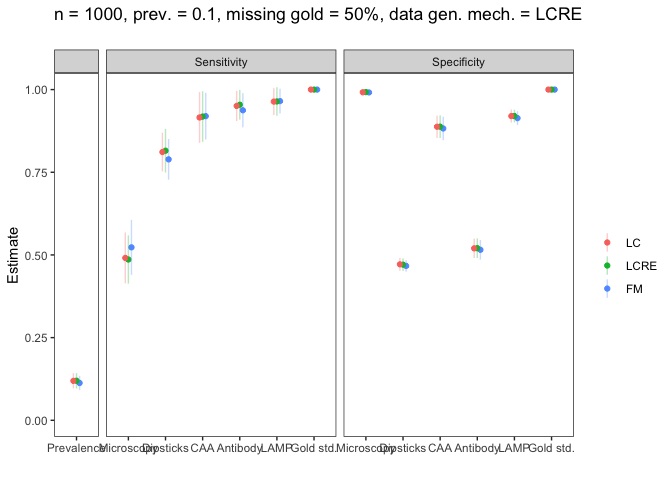

<!-- README.md is generated from README.Rmd. Please edit that file -->

# R/diagacc: Modelling diagnostic errors using latent class models

[](https://travis-ci.org/haziqj/diagacc)
[](https://ci.appveyor.com/project/haziqj/diagacc)
[](https://codecov.io/github/haziqj/diagacc?branch=master)

This is the `R` package accompanying our paper: *Evaluating diagnostic
tests and quantifying prevalence for Tropical Infectious Diseases: a
Paradigm of Latent Class Modelling Approaches With and Without a Gold
Standard for Schistosomiasis Diagnosis*. There are three models
primarily used in this package: latent class model (LC), latent class
with random effects model (LCRE), and a finite mixture model (FM).
Details of these models and their use for modelling diagnostic errors
are found in the paper.

The package includes functions to

1.  Simulate a data set from either the LC, LCRE or FM model.
2.  Wrapper functions to fit such models using MCMC (`JAGS`) and obtain
    estimates posterior standard deviations of sensitivities,
    specificities, prevalence.
3.  Functions to perform a simulation study, as per the following
    regime:
      - Simulate data based on a certain scenario (sensitivities,
        specificities, prevalance, proportion of missing gold standard,
        and data generating mechanism)
      - Fit the data using LC, LCRE and FM models
      - Repeat the above two steps using a different random seed, and
        results averaged The results are shown in tabular form or in a
        graph.

# Installation and setting options

The easiest way to then install from this repo is by using the
[devtools](https://github.com/hadley/devtools) package. Install this
first.

``` r
install.packages("devtools")
```

Then, run the following code to install and attach the `diagacc`
package.

``` r
devtools::install_github("haziqj/diagacc")
#> Skipping install of 'diagacc' from a github remote, the SHA1 (1e864f12) has not changed since last install.
#>   Use `force = TRUE` to force installation
library(diagacc)
#> Using the following sensitivities and specificities for the tests.
#> Use diagacc_opt() to change these settings.
#>            Sensitivity Specificity
#> Microscopy        0.60        0.99
#> Dipsticks         0.73        0.45
#> CAA               0.90        0.87
#> Antibody          0.90        0.50
#> LAMP              0.95        0.90
#> Gold std.         1.00        1.00
```

The default number of items is six (including a gold standard item),
with the sensitivities and specificities as shown above. To change this,
use the `diagacc_opt()` function.

``` r
# Change sensitivities, specificities and item names
diagacc_opt(sens = c(0.1, 0.2, 0.3), spec = c(0.1, 0.2, 0.3), 
            item.names = LETTERS[1:3])
#>   Sensitivity Specificity
#> A         0.1         0.1
#> B         0.2         0.2
#> C         0.3         0.3

# Restore default options
diagacc_opt(default = TRUE)
#>            Sensitivity Specificity
#> Microscopy        0.60        0.99
#> Dipsticks         0.73        0.45
#> CAA               0.90        0.87
#> Antibody          0.90        0.50
#> LAMP              0.95        0.90
#> Gold std.         1.00        1.00
```

# Simulating data sets

The functions to simulate a data set are `gen_lc()`, `gen_lcre()` and
`gen_fm()`.

``` r
# Sample size (n), proportion of missing gold item (miss.prop), and prevalence
# (tau), using a specific random seedmys
X <- gen_lc(n = 1000, miss.prop = 0.5, tau = 0.1, seed = 123)
head(X)
#>   Microscopy Dipsticks CAA Antibody LAMP Gold std.
#> 1          0         0   0        1    0        NA
#> 2          0         0   0        0    0        NA
#> 3          0         1   0        1    0         0
#> 4          0         0   0        0    0        NA
#> 5          1         0   1        1    1        NA
#> 6          0         0   0        0    0        NA
```

# Obtain estimates

The functions for model fitting are `fit_lc()`, `fit_lcre()` and
`fit_fm()`. The MCMC options are pretty much the default settings in
`rjags`. These, of course, can be changed–see the help files for more
information.

``` r
# Fitting a LC model using MCMC
(mod1 <- fit_lc(X))
#> Warning: The length of the initial values argument supplied found does
#> not correspond to the number of chains specified. Some initial values were
#> recycled or ignored.
#> Loading required namespace: rjags
#> module lecuyer loaded
#> module dic loaded
#> Compiling rjags model...
#> Calling the simulation using the rjags method...
#> Adapting the model for 200 iterations...
#> Burning in the model for 800 iterations...
#> Running the model for 2000 iterations...
#> Simulation complete
#> Calculating summary statistics...
#> Calculating the Gelman-Rubin statistic for 14 variables....
#> Finished running the simulation
#> Latent class model fit
#>                  Mean    SE  2.5% 97.5%
#> Prevalence      0.099 0.010 0.080 0.120
#> Sens.Microscopy 0.500 0.053 0.400 0.609
#> Sens.Dipsticks  0.674 0.051 0.571 0.768
#> Sens.CAA        0.841 0.041 0.759 0.915
#> Sens.Antibody   0.908 0.031 0.845 0.962
#> Sens.LAMP       0.903 0.035 0.831 0.969
#> Sens.Gold std.  0.943 0.045 0.855 1.000
#> Spec.Microscopy 0.987 0.004 0.979 0.994
#> Spec.Dipsticks  0.443 0.017 0.412 0.476
#> Spec.CAA        0.884 0.011 0.861 0.905
#> Spec.Antibody   0.508 0.017 0.475 0.541
#> Spec.LAMP       0.910 0.010 0.890 0.930
#> Spec.Gold std.  0.997 0.002 0.992 1.000
```

There is also the option for `raw = TRUE`, which returns the actual
`rjags` or object for further inspection or manipulation. This is
especially useful for MCMC diagnostics.

``` r
# Running 8 chains in parallel 
mod2 <- fit_lcre(X, method = "MCMC", raw = TRUE, silent = TRUE, n.chains = 8, 
                 runjags.method = "parallel")
#> Warning: The length of the initial values argument supplied found does
#> not correspond to the number of chains specified. Some initial values were
#> recycled or ignored.
#> Warning: You attempted to start parallel chains without setting different
#> PRNG for each chain, which is not recommended. Different .RNG.name values
#> have been added to each set of initial values.
#> Loading required namespace: rjags
#> module lecuyer loaded
plot(mod2, plot.type = "density", layout = c(3, 2), vars = "beta")
```

<!-- --><!-- -->

# Simulation study

To perform a simulation study, use the `run_sim_par()` function. For
instance, consider the following scenario: sample size = 500, prevalence
= 0.1, missing gold standard = 20%, and data generated from a LCRE
model. We shall run this for a total of `B=8` replications (just for
show). The result is a table showing the estimates of the prevalance,
sensitivities and specificities for all items except gold standard item,
as fitted using the LC, LCRE and FM model.

``` r
(res <- run_sim_par(B = 8, n = 1000, tau = 0.1, miss.prop = 0.5,
                    data.gen = "lcre", no.cores = 8))
#> n = 1000, prev. = 0.1, missing gold = 50%, data gen. mech. = LCRE
#> 
  |                                                                       
  |                                                                 |   0%
  |                                                                       
  |========                                                         |  12%
  |                                                                       
  |================                                                 |  25%
  |                                                                       
  |========================                                         |  38%
  |                                                                       
  |================================                                 |  50%
  |                                                                       
  |=========================================                        |  62%
  |                                                                       
  |=================================================                |  75%
  |                                                                       
  |=========================================================        |  88%
  |                                                                       
  |=================================================================| 100%
#> Summary from 8 replications (n = 1000, prev. = 0.1, missing gold = 50%, data gen. mech. = LCRE)
#> Statistic: Parameter estimates 
#> 
#> LC model fit
#>                     EST      SE    2.5%   97.5%
#> Prevalence      0.11928 0.01174 0.09626 0.14229
#> Sens.Microscopy 0.49093 0.03928 0.41395 0.56791
#> Sens.Dipsticks  0.81116 0.02992 0.75252 0.86980
#> Sens.CAA        0.91566 0.03916 0.83891 0.99241
#> Sens.Antibody   0.95064 0.02322 0.90512 0.99616
#> Sens.LAMP       0.96369 0.02070 0.92311 1.00427
#> Sens.Gold std.  0.99999 0.00000 0.99999 1.00000
#> Spec.Microscopy 0.99178 0.00214 0.98759 0.99596
#> Spec.Dipsticks  0.47160 0.00982 0.45236 0.49084
#> Spec.CAA        0.88760 0.01714 0.85400 0.92120
#> Spec.Antibody   0.51993 0.01499 0.49055 0.54932
#> Spec.LAMP       0.91992 0.00999 0.90034 0.93951
#> Spec.Gold std.  0.99999 0.00000 0.99999 1.00000
#> 
#> LCRE model fit
#>                     EST      SE    2.5%   97.5%
#> Prevalence      0.11963 0.01178 0.09654 0.14272
#> Sens.Microscopy 0.48617 0.03727 0.41312 0.55922
#> Sens.Dipsticks  0.81517 0.03373 0.74906 0.88127
#> Sens.CAA        0.91837 0.03905 0.84184 0.99491
#> Sens.Antibody   0.95416 0.02298 0.90912 0.99920
#> Sens.LAMP       0.96406 0.02194 0.92106 1.00705
#> Sens.Gold std.  1.00000 0.00000 1.00000 1.00000
#> Spec.Microscopy 0.99235 0.00256 0.98733 0.99738
#> Spec.Dipsticks  0.47060 0.00968 0.45163 0.48957
#> Spec.CAA        0.88790 0.01746 0.85369 0.92211
#> Spec.Antibody   0.52039 0.01524 0.49052 0.55025
#> Spec.LAMP       0.91996 0.00985 0.90066 0.93926
#> Spec.Gold std.  1.00000 0.00000 1.00000 1.00000
#> 
#> FM model fit
#>                     EST      SE    2.5%   97.5%
#> Prevalence      0.11281 0.01102 0.09121 0.13441
#> Sens.Microscopy 0.52298 0.04240 0.43988 0.60609
#> Sens.Dipsticks  0.78900 0.03142 0.72742 0.85058
#> Sens.CAA        0.91965 0.03603 0.84904 0.99027
#> Sens.Antibody   0.93740 0.02637 0.88572 0.98908
#> Sens.LAMP       0.96513 0.01904 0.92781 1.00245
#> Sens.Gold std.  1.00000 0.00000 1.00000 1.00000
#> Spec.Microscopy 0.99133 0.00226 0.98689 0.99576
#> Spec.Dipsticks  0.46688 0.00895 0.44934 0.48441
#> Spec.CAA        0.88238 0.01809 0.84692 0.91785
#> Spec.Antibody   0.51562 0.01516 0.48590 0.54534
#> Spec.LAMP       0.91363 0.01075 0.89255 0.93470
#> Spec.Gold std.  1.00000 0.00000 1.00000 1.00000
```

The `run_sim_par()` runs the replications concurrently in parallel
across the specified number of cores of the machine. There is also a
non-parallel implementation of this function called `run_sim()`.

One can also plot the results, as follows:

``` r
plot(res)
#> Warning in if (type == "bias") {: the condition has length > 1 and only the
#> first element will be used
#> Warning in if (type == "est") {: the condition has length > 1 and only the
#> first element will be used
#> Warning in if (type == "sd") {: the condition has length > 1 and only the
#> first element will be used
```

<!-- -->

One thing to mention is that it is possible to add more replications of
a particular saved `diagaccSim1` object created by `run_sim()` or
`run_sim_par()` simply by running the following code:

``` r
# To run additional B = 100 simulations
run_sim(object = res, B = 100)
run_sim_par(object = res, B = 100)
```

It will automatically read in all the previous simulation scenarios.

# Running multiple simulation studies

Often, there is an interest to run multiple simulation scenarios, for
example, multiple sample sizes, prevalences, and proportion of missing
gold standard. One might use the above functions in a nested for loop
manually, or use the in-built `run_study()` and `run_study_par()`
functions.

``` r
res <- run_study_par(B = 8, n = 250, tau = c(0.08, 0.4), miss.prop = 1.0)
```

The above code will run a total of six simulation scenarios (1 sample
size x 2 prevalences x 1 missing gold proportions x 3 data generating
mechanisms). To access any one of these scenarios, use the corresponding
`sim.key`. Currently available methods are `print()` and `plot()`.

``` r
res
#> Use print(object, sim.key = <number>), where <number> is from the following:
#>     n prevalence missing gold data gen. mech.
#> 1 250       0.08         100%              LC
#> 2 250       0.40         100%              LC
#> 3 250       0.08         100%            LCRE
#> 4 250       0.40         100%            LCRE
#> 5 250       0.08         100%              FM
#> 6 250       0.40         100%              FM
```
