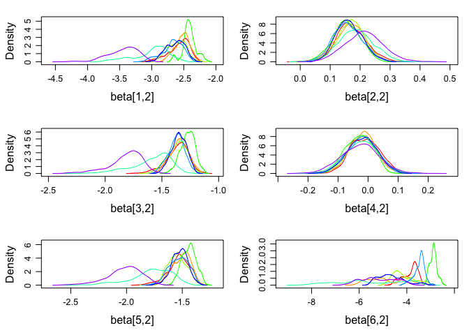

<!-- README.md is generated from README.Rmd. Please edit that file -->
R/diagacc: Modelling diagnostic errors using latent class models
================================================================

[](https://travis-ci.org/haziqj/diagacc) [](https://ci.appveyor.com/project/haziqj/diagacc) [](https://codecov.io/github/haziqj/diagacc?branch=master)

This is the `R` package accompanying our paper: *Diagnostic Accuracy for Schistosomiasis: Applications of Latent Class Modelling Approaches With and Without a Gold Standard*. There are three models primarily used in this package: latent class model (LC), latent class with random effects model (LCRE), and a finite mixture model (FM). Details of these models and their use for modelling diagnostic errors are found in the paper.

The package includes functions to

1.  Simulate a data set from either the LC, LCRE or FM model.
2.  Wrapper functions to fit such models and obtain estimates and standard errors/posterior standard deviations of sensitivities, specificities, prevalence.
    -   LC and LCRE models can be fitted using EM algorithm (`randomLCA` package) or MCMC (`JAGS`)
    -   FM models are fitted using MCMC (`JAGS`)
3.  Functions to perform a simulation study, as per the following:
    -   Simulate data based on a certain scenario (sensitivities, specificities, prevalance, proportion of missing gold standard, and data generating mechanism)
    -   Fit the data using LC, LCRE and FM models
    -   Repeat the above two steps using a different random seed, and results averaged The results are shown in tabular form or in a graph.

Installation and setting options
================================

The easiest way to then install from this repo is by using the [devtools](https://github.com/hadley/devtools) package. Install this first.

``` r
install.packages("devtools")
```

Then, run the following code to install and attach the `diagacc` package.

``` r
## devtools::install_github("haziqj/diagacc")
library(diagacc)
#> Using the following sensitivities and specificities for the tests.
#> Use diagacc_opt() to change these settings.
#>            Sensitivity Specificity
#> Microscopy        0.60        0.99
#> Dipsticks         0.73        0.45
#> CAA               0.90        0.87
#> Antibody          0.90        0.50
#> LAMP              0.95        0.90
#> Gold std.         1.00        1.00
```

The default number of items is six (including a gold standard item), with the sensitivities and specificities as shown above. To change this, use the `diagacc_opt()` function.

``` r
# Change sensitivities, specificities and item names
diagacc_opt(sens = runif(6), spec = runif(6), item.names = LETTERS[1:6])
#>   Sensitivity Specificity
#> A   0.3479356   0.6709465
#> B   0.8002093   0.3470614
#> C   0.5780920   0.4117372
#> D   0.3756338   0.8678447
#> E   0.6170210   0.8471394
#> F   0.1421553   0.9017014

# Restore default options
diagacc_opt(default = TRUE)
#>            Sensitivity Specificity
#> Microscopy        0.60        0.99
#> Dipsticks         0.73        0.45
#> CAA               0.90        0.87
#> Antibody          0.90        0.50
#> LAMP              0.95        0.90
#> Gold std.         1.00        1.00
```

Simulating data sets
====================

The functions to simulate a data set are `gen_lc()`, `gen_lcre()` and `gen_fm()`.

``` r
# Sample size (n), proportion of missing gold item (miss.prop), and prevalence
# (tau), using a specific random seedmys
X <- gen_lc(n = 1000, miss.prop = 0.5, tau = 0.1, seed = 123)
head(X)
#>   Microscopy Dipsticks CAA Antibody LAMP Gold std.
#> 1          0         0   0        1    0        NA
#> 2          0         0   0        0    0        NA
#> 3          0         1   0        1    0         0
#> 4          0         0   0        0    0        NA
#> 5          1         0   1        1    1        NA
#> 6          0         0   0        0    0        NA
```

Obtain estimates
================

The functions for model fitting are `fit_lc()`, `fit_lcre()` and `fit_fm()`. The first two of these functions has the option `method = c("EM", "MCMC")`.

``` r
# Fitting a LC model using EM algorithm
(mod1 <- fit_lc(X))
#> $prevalence
#> [1] 0.09606515
#> 
#> $sens.and.spec
#>            Sensitivity Specificity
#> Microscopy   0.5090139   0.9877177
#> Dipsticks    0.6758673   0.4423591
#> CAA          0.8535290   0.8838352
#> Antibody     0.9178501   0.5067962
#> LAMP         0.9145385   0.9091265
#> 
#> $se.prev
#> [1] 0.1214575
#> 
#> $se.sens.and.spec
#>            Sensitivity Specificity
#> Microscopy   0.1372929  0.12443230
#> Dipsticks    0.1397397  0.04208410
#> CAA          0.1831331  0.05681371
#> Antibody     0.2018094  0.04212730
#> LAMP         0.2189492  0.06376226
```

``` r
# Fitting a LC model using MCMC
(mod2 <- fit_lc(X, method = "MCMC"))
#> Loading required namespace: rjags
#> module lecuyer loaded
#> Compiling rjags model...
#> Calling the simulation using the rjags method...
#> Adapting the model for 200 iterations...
#> Burning in the model for 800 iterations...
#> Running the model for 10000 iterations...
#> Simulation complete
#> Calculating summary statistics...
#> Warning: Convergence cannot be assessed with only 1 chain
#> Finished running the simulation
#> $prevalence
#>        tau 
#> 0.09951549 
#> 
#> $sens.and.spec
#>            Sensitivity Specificity
#> Microscopy   0.5001595   0.9869563
#> Dipsticks    0.6728711   0.4426112
#> CAA          0.8398559   0.8843946
#> Antibody     0.9065574   0.5076776
#> LAMP         0.9049010   0.9102854
#> 
#> $se.prev
#>        tau 
#> 0.01030261 
#> 
#> $se.sens.and.spec
#>            Sensitivity Specificity
#> Microscopy  0.05243122 0.004033160
#> Dipsticks   0.04873445 0.017031628
#> CAA         0.04175618 0.011274508
#> Antibody    0.03219146 0.016915174
#> LAMP        0.03438146 0.009951935
```

There is also the option for `raw = TRUE`, which return the actual `rjags` or `randomLCA` object for further inspection or manipulation. This is especially useful for MCMC diagnostics.

``` r
# Running 8 chains in parallel 
mod3 <- fit_lcre(X, method = "MCMC", raw = TRUE, silent = TRUE, n.chains = 8, 
                 runjags.method = "parallel")
#> Warning: The length of the initial values argument supplied found does
#> not correspond to the number of chains specified. Some initial values were
#> recycled or ignored.
#> Warning: You attempted to start parallel chains without setting different
#> PRNG for each chain, which is not recommended. Different .RNG.name values
#> have been added to each set of initial values.
#> Loading required namespace: rjags
#> module lecuyer loaded
plot(mod3, plot.type = "density", layout = c(3, 2), vars = "beta")
```



Simulation study
================

To perform a simulation study, use the `run_sim_par()` function. For instance, consider the following scenario: sample size = 500, prevalence = 0.1, missing gold standard = 20%, and data generated from a LCRE model. We shall run this for a total of `B=8` replications (just for show). The result is a table showing the estimates of the prevalance, sensitivities and specificities for all items except gold standard item, as fitted using the LC, LCRE and FM model.

``` r
(res <- run_sim_par(B = 8, n = 1000, tau = 0.1, miss.prop = 0.5,
                    data.gen = "lcre", no.cores = 8))
#> n = 1000, prev. = 0.1, missing gold = 50%, data gen. mech. = LCRE
#> 
  |                                                                       
  |                                                                 |   0%
  |                                                                       
  |========                                                         |  12%
  |                                                                       
  |================                                                 |  25%
  |                                                                       
  |========================                                         |  38%
  |                                                                       
  |================================                                 |  50%
  |                                                                       
  |=========================================                        |  62%
  |                                                                       
  |=================================================                |  75%
  |                                                                       
  |=========================================================        |  88%
  |                                                                       
  |=================================================================| 100%
#> LC model fit
#>                 truth    Est      2.5%     97.5%    SE       2.5%    
#> Prevalence        0.100    0.247    0.219    0.275    0.090    0.077 
#> Sens.Microscopy   0.600    0.293    0.236    0.350    2.167   -3.584 
#> Sens.Dipsticks    0.730    0.906    0.835    0.978    0.091   -0.031 
#> Sens.CAA          0.900    0.834    0.690    0.977    0.152    0.061 
#> Sens.Antibody     0.900    0.983    0.968    0.998    0.133   -0.102 
#> Sens.LAMP         0.950    0.710    0.665    0.755    0.127    0.061 
#> Spec.Microscopy   0.990    1.000    1.000    1.000    2.166   -3.594 
#> Spec.Dipsticks    0.450    0.541    0.523    0.558    0.078   -0.006 
#> Spec.CAA          0.870    0.986    0.982    0.989    0.166    0.138 
#> Spec.Antibody     0.500    0.581    0.512    0.650    0.159   -0.148 
#> Spec.LAMP         0.900    0.985    0.970    1.000    0.159   -0.017 
#>                 97.5%   
#> Prevalence        0.103 
#> Sens.Microscopy   7.918 
#> Sens.Dipsticks    0.213 
#> Sens.CAA          0.242 
#> Sens.Antibody     0.369 
#> Sens.LAMP         0.192 
#> Spec.Microscopy   7.926 
#> Spec.Dipsticks    0.162 
#> Spec.CAA          0.194 
#> Spec.Antibody     0.465 
#> Spec.LAMP         0.334 
#> 
#> LCRE model fit
#>                 truth   Est     2.5%    97.5%   SE      2.5%    97.5%  
#> Prevalence       0.100   0.104   0.065   0.143   0.129   0.099   0.158 
#> Sens.Microscopy  0.600   0.672   0.304   1.039   0.405   0.182   0.627 
#> Sens.Dipsticks   0.730   0.877   0.793   0.962   0.082   0.075   0.090 
#> Sens.CAA         0.900   0.991   0.978   1.003   0.123   0.095   0.151 
#> Sens.Antibody    0.900   0.995   0.993   0.997   0.081   0.074   0.088 
#> Sens.LAMP        0.950   0.999   0.998   1.001   0.152   0.091   0.214 
#> Spec.Microscopy  0.990   1.000   1.000   1.000   0.317   0.152   0.482 
#> Spec.Dipsticks   0.450   0.413   0.366   0.460   0.278   0.225   0.331 
#> Spec.CAA         0.870   0.982   0.973   0.991   0.485   0.351   0.619 
#> Spec.Antibody    0.500   0.480   0.343   0.618   0.431   0.335   0.528 
#> Spec.LAMP        0.900   0.993   0.984   1.003   0.693   0.326   1.061 
#> 
#> FM model fit
#>                 truth   Est     2.5%    97.5%   SE      2.5%    97.5%  
#> Prevalence       0.100   0.183   0.104   0.261   0.020   0.005   0.034 
#> Sens.Microscopy  0.600   0.478   0.416   0.540   0.045   0.028   0.062 
#> Sens.Dipsticks   0.730   0.868   0.768   0.967   0.028   0.028   0.028 
#> Sens.CAA         0.900   0.941   0.889   0.993   0.026   0.026   0.027 
#> Sens.Antibody    0.900   0.971   0.962   0.980   0.014   0.007   0.021 
#> Sens.LAMP        0.950   0.942   0.942   0.943   0.033   0.022   0.044 
#> Spec.Microscopy  0.990   0.999   0.998   0.999   0.001   0.001   0.001 
#> Spec.Dipsticks   0.450   0.491   0.455   0.528   0.018   0.015   0.021 
#> Spec.CAA         0.870   0.920   0.918   0.923   0.010   0.008   0.012 
#> Spec.Antibody    0.500   0.526   0.436   0.615   0.017   0.016   0.018 
#> Spec.LAMP        0.900   0.956   0.929   0.983   0.008   0.006   0.009
```

The `run_sim_par()` runs the replications concurrently in parallel across the specified number of cores of the machine. There is also a non-parallel implementation of this function called `run_sim()`.

One can also plot the results, as follows:

``` r
plot(res)
```


One thing to mention is that it is possible to add more replications of a particular saved `diagaccSim1` object created by `run_sim()` or `run_sim_par()` simply by running the following code:

``` r
# To run additional B = 100 simulations
run_sim(object = res, B = 100)
run_sim_par(object = res, B = 100)
```

It will automatically read in all the previous simulation scenarios.

Running multiple simulation studies
===================================

Often, there is an interest to run multiple simulation scenarios, for example, multiple sample sizes, prevalences, and proportion of missing gold standard. One might use the above functions in a nested for loop manually, or use the in-built `run_study()` and `run_study_par()` functions.

``` r
res <- run_study_par(B = 8, n = 250, tau = c(0.08, 0.4), miss.prop = 1.0)
```

The above code will run a total of 36 simulation scenarios. To access any one of these scenarios, use the corresponding `sim.key`.

``` r
res
#> Use print(object, sim.key = <number>), where <number> is from the following:
#>     n prevalence missing gold data gen. mech.
#> 1 250       0.08         100%              LC
#> 2 250       0.40         100%              LC
#> 3 250       0.08         100%            LCRE
#> 4 250       0.40         100%            LCRE
#> 5 250       0.08         100%              FM
#> 6 250       0.40         100%              FM
```
